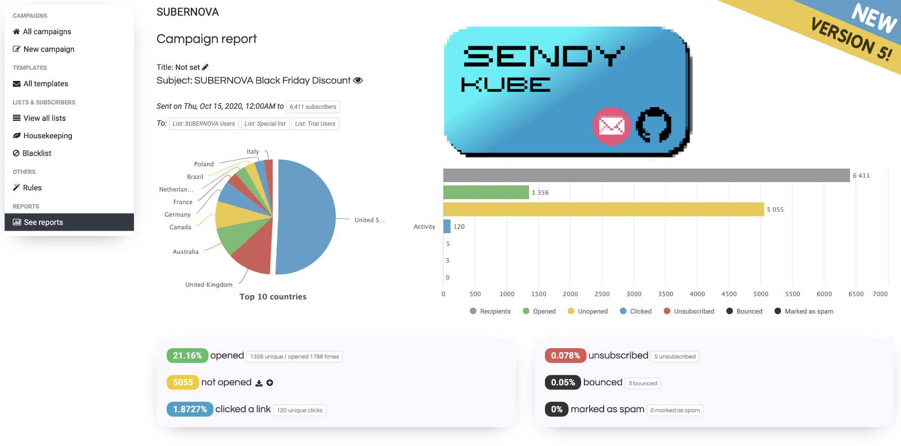

<p align="center">
    <a href="https://github.com/jotcodeofficial/sendy-kube">
        
    </a>
 <h2 align="center">Sendy Kube</h2>
 <p align="center">Deploy Sendy on Kubernetes</p>
</p>
  <p align="center">
    <a href="https://github.com/jotcodeofficial/sendy-kube/network/members">
      
    </a>
    <a href="https://github.com/jotcodeofficial/sendy-kube/stargazers">
      
    </a>
    <a href="https://twitter.com/intent/follow?screen_name=jotc0de" target="_blank">
      
    </a>
    <br />
    <br />
    <a href="https://blog.jotcode.com" target="_blank">
      
    </a>
    <a href="https://jotcode.com" target="_blank">
      
    </a>
    
  </p>

  <p align="center">
    <a href="https://github.com/jotcodeofficial/sendy-kube/issues/new/choose">Report Bug</a>
    -
    <a href="https://github.com/jotcodeofficial/sendy-kube/issues/new/choose">Request Feature</a>
  </p>

# Index

<!-- TABLE OF CONTENTS -->
<details closed="closed">
  <summary>Table of Contents</summary>
  <ol>
    <li>
      <a href="#about-the-project">About The Project</a>
      <ul>
        <li><a href="#built-with">Built With</a></li>
      </ul>
    </li>
    <li>
      <a href="#getting-started">Getting Started</a>
      <ul>
        <li><a href="#prerequisites">Prerequisites</a></li>
        <li><a href="#installation">Installation</a></li>
      </ul>
    </li>
    <li><a href="#usage">Documentation</a></li>
    <li><a href="#contributing">Contributing</a></li>
    <li><a href="#license">License</a></li>
    <li><a href="#contact">Contact</a></li>
    <li><a href="#support-the-project-sparkling_heart">Support the Project</a></li>
    <li><a href="#acknowledgements">Acknowledgements</a></li>
  </ol>
</details>

## About The Project

<p align="center">
    <a href="https://github.com/jotcodeofficial/sendy-kube">
        
    </a>
 <h2 align="center">Sendy Kube</h2>
 <p align="center">Deploy Sendy on Kubernetes</p>
</p>

Sendy is a self hosted email newsletter application that lets you send trackable emails via Amazon Simple Email Service (SES). This makes it possible for you to send authenticated bulk emails at an insanely low price without sacrificing deliverability.

So what can be better than that? Sendy on Kubernetes!

---

### Built With

* [Sendy](https://sendy.co/?ref=1yMCs)
* [Gitlab](https://gitlab.com/)

Useful extras:

* [Kubectl](https://kubernetes.io/docs/tasks/tools/)


## Getting Started

This repo was built together with this guide (follow this as it is more thorough):

<a href="https://blog.jotcode.com/deploying-sendy-on-kubernetes">Deploying Sendy on Kubernetes</a>

### Prerequisites

Get your cluster, if you don't have one you can deploy one on Digital Ocean:

<a href="https://www.digitalocean.com/?refcode=b972b3a2a6eb&utm_campaign=Referral_Invite&utm_medium=Referral_Program&utm_source=badge"></a>

Be sure you also get your Sendy license, you can can use my referral code and get some % off here: <a href="https://sendy.co/?ref=1yMCs">Sendy</a>

Ensure staging.yourdomainname.com and yourdomainname.com are both individually set to point at your clusters loadbalancer (I am using Traefik, you might be using nginx etc).

I am using Gitlab for my build script (.gitlab-ci.yml). When that file is deployed it will start the deploy process. If you are not using Gitlab or want to deploy manually, you can just copy the commands in the file and run them from the terminal in order of the stages using kubectl.

### Installation

Here you can provide the steps required to install your project on the users machine.

1. Clone the repo
   ```sh
   git clone https://github.com/jotcodeofficial/sendy-kube.git
   ```
2. Edit all the files for your own domains
3. Deploy files to your own repo (re-enable the .gitinore file)
3. Edit .gitlab-ci.yml then deploy 
   ```sh
   git add *
   git add .gitlab-ci.yml
   git commit -m "deploy time"
   git push -u origin master
   ```

## Documentation

When your Sendy application is live you can configure the alias manually for your client domains by doing the following:
(Ensure your clientdomain A records point to your cluster in your domain server)

```sh
  kubectl apply -f production/alias/newsletter-clientdomain-ingress-route.yml
  kubectl apply -f production/alias/newsletter-clientdomain-secure-ingress-route.yml
  kubectl apply -f production/alias/newsletter-clientdomain-issuer.yml
  kubectl apply -f production/alias/newsletter-clientdomain-solver.yml
 ```

 You can do the same for staging.

## Contributing

Great things are a sum of their parts. By contributing your time and effort you can help make this project even better. Collaborative efforts ftw.

## License

Released under the MIT License.

## Contact

[@jotc0de](https://twitter.com/jotc0de)

contact@jotcode.com

## Support the Project :sparkling_heart:

If you are not a coder you can still help support the project by sharing it far and wide.
Thanks! :heart:

## Acknowledgements

I would like to acknowledge the following projects for inspiration:

https://github.com/bubbajames-docker/sendy

https://chris-vermeulen.com/using-gitlab-registry-with-kubernetes/
